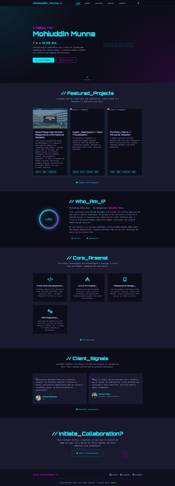

# Mohiuddin Munna - Personal Portfolio



Welcome to the official GitHub repository for my personal portfolio website! This site showcases my journey as a UI/UX enthusiast and Front-End Web Developer, highlighting my projects, skills, and approach to crafting intuitive and engaging digital experiences.

**Live Site:** [https://mohiuddinmunna.netlify.app]

## About This Portfolio

This portfolio is designed to be a dynamic representation of my capabilities and creative vision. It features:

*   **Modern UI/UX:** A sleek, cyberpunk-inspired design with smooth animations and transitions.
*   **Featured Projects:** Detailed showcases of my key projects, including "Alokchhaya High School," "Cyber_Dashboard," and this portfolio itself ("Portfolio_Matrix").
*   **Skills Overview ("Core_Arsenal"):** Highlighting my expertise in Front-End Development, UI/UX Principles, Responsive Design, and API Integration.
*   **Client Testimonials ("Client_Signals"):** Feedback from those I've collaborated with.
*   **Interactive Elements:** Engaging user interactions to enhance the browsing experience.
*   **Responsive Design:** Optimized for seamless viewing across all devices.

## Technologies Used

This portfolio was built using a combination of modern web technologies:

*   **HTML5:** For semantic structure.
*   **CSS3:** For styling, layout (Flexbox/Grid), and custom properties.
    *   Possibly **SCSS/Sass** if you used a preprocessor.
*   **JavaScript (ES6+):** For interactivity, animations, and dynamic content.
*   **GSAP (GreenSock Animation Platform): For advanced animations and transitions.

## Key Features Implemented

*   **Hero Section:** Eye-catching introduction with a typing effect and clear calls-to-action.
*   **Project Cards:** Interactive cards to display project details and technologies used.
*   **Smooth Scrolling & Navigation:** Easy navigation with a fixed header and smooth scroll effects.
*   **Dark Mode Toggle:** 
*   **Animated SVGs/Icons:** For visual appeal and interactivity.
*   **Contact Form/Section:** To initiate collaboration.

## Setup and Development

To run this project locally:

1.  Clone the repository:
    ```bash
    git clone https://github.com/YOUR_USERNAME/YOUR_REPOSITORY_NAME.git
    ```
2.  Navigate to the project directory:
    ```bash
    cd YOUR_REPOSITORY_NAME
    ```
3.  Open `index.html` in your browser.
    *   (If you have a build step or use a local server, add instructions here, e.g., `npm install` then `npm start`)

## Connect With Me

*   **LinkedIn:** []
*   **GitHub:** [https://github.com/Mohiuddin-Munna] (this repository's owner)
*   **Dribbble:** [] 
*   **Email:** [mohiuddinmunna06@gmail.com] 

---

Thank you for visiting! Feel free to explore the code and reach out if you have any questions or collaboration ideas.

*<End_Transmission />*
